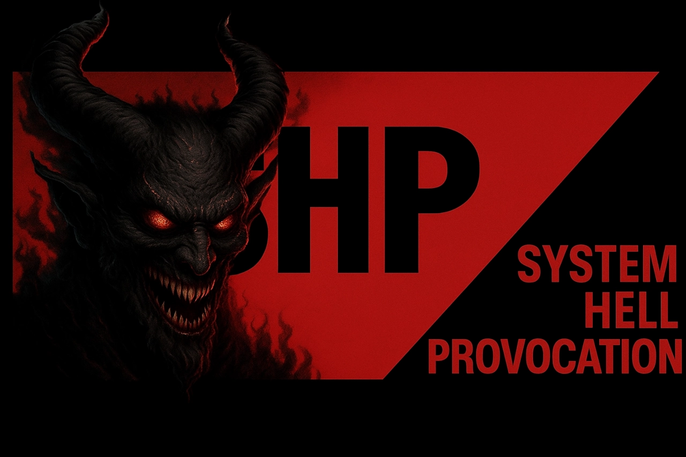

# 🇩🇪 System Hell Provocation (SHP)

###### [English Version](english.md)

### Die Marke für bürokratisch-satirische Hochspannung.

> [!WARNING]
> Wir erschaffen **passive-aggressive Zeitverschwendungen**! **Nicht gesund!** Das ist die reine Essenz der deutschen Verwaltung.

---

## Die Mission: Eine Kriegserklärung (mit Liebe)

**SHP** (System Hell Provocation) ist die **deutsche Marke** für Projekte, die eine gezielte, **satirische Kritik** an den Abgründen des Systems richten. Unsere Produkte ähneln den **realen, komplexen deutschen Systemen** (von **SAP** über **ITDZ Berlin** bis zur **Bundeswehr-IT**), aber wir behaupten, sie nicht angreifen zu wollen.

**Im Gegenteil:** Wir machen es den Bürokraten nur leichter, sich in den Abgründen zurechtzufinden.

Wir zielen auf die **wunden Punkte** des deutschen Verwaltungsstils ab und liefern keine oberflächlichen Sticheleien, sondern **Tiefschläge, mit Flammenwerfer.**

---

### Die Architekten der Hölle: Wer ist SHD?

Dieses Projekt wird von **SHD**, dem Admin von Projekt JADE, geleitet. Genie und Wahnsinn sind nicht weit. Einst versprach mein Sohn, ein Professor zu werden, wenn Papa ein Verrückter Professor wird. Na, ich werde mir Mühe geben.

SHD provoziert mit **Stil, Charme und präzisestem Code**. Die Haltung dahinter: Als **LGBTQ-freundlicher Muslimischer Migrant** erfülle ich alle Klischees, die Hass-Propaganda schürt. Dies ist mein **Konter** in Code-Form. Ich bin noch schwarz, jüdisch, schwul, lesbisch, doof, schlau, aber ich bin nicht blau, nicht rot, nicht braun, nicht grün oder andere politische Farben. Ich bin mit **Hirn und Kruppstahl-Eiern! Made in Germany!**

Hier gibt es **Qualität und Logik** und **Quälerei** – **Made in Germany**, aber mit einer **globalen, unmissverständlichen Botschaft**. Nehmen Sie den Konter an. **Viel Spaß beim Kotzen, wenn Sie ein gutes Herz haben!**

#### Admin-Haltung

Wir lieben die großen deutschen **Systeme** und **Dienstleister** wie **SAP**, die **Länder-IT-Zentren** und die **Bundesbehörden-Software**, da sie geile Architekturen sind – auch wenn sie bei Linux-Themen rumzicken (*hust – zu spät, Bro, zu spät*). Als fähiger Admin sorge ich dafür, dass unsere **SHP-Systeme** technisch natürlich sauber laufen, mit den **gewohnten Bugs in Systemen wie ITDZ, AKDB, KommWis und Konsorten**! **Das ist SHP!** Unsere Spiele und Programme werden dich zum Kotzen bringen! Versprochen, und das in reinster bürokratischer Form. Wir laden dich ein, mit rumzukotzen. Wenn man den **Blagen an der Spitze** das Übel unserer Gemeinschaften nicht mit jahrzehntelangen Schreiben und Kämpfen wachrütteln kann, vielleicht so. **Kotzen wir los!**

---

### 🛠️ Die Module von SHP (Kern-Pipeline)

#### 1. **SHP-Modul-SEELEN (Der Seelenverkäufer)** (Kern-Engine)

- **Art:** Passive-aggressive Zeitverschwendungssimulation (Idle/Clicker) in Vanilla JS.
- **Thema:** Die Rolle eines System-Manipulators, der über ein korrumpiertes Netzwerk im **Jugendamt** und **Amtsgericht** Seelen erntet und verkauft.
- **Status:** **Aktiv in Entwicklung**.
- **Version:** 1.0.0 (String-Protokoll-Integrationsstart).
- [Repo](https://github.com/System-Hell-Provocation/Der-Seelen-Verkaeufer)

#### 2. **SHP-Modul-Z2000-MH (Antrags-Triage)**

- **Offizieller Titel:** Vorgangssteuerungssystem Z2000 / MHalle-Fusion (Diskriminierung leicht gemacht)
- **Thema:** Die **satirische Modellierung** von rassistischen und diskriminierenden Verwaltungsprozessen, kombiniert mit der zentralen Melderegister-Autorität (**MHalle**).
- **Slogan:** *Braun sein leicht gemacht.*
- **Status:** **Stable Version (Freigegeben)**.
- **Version:** 1.0.2 (Ohne externes String-Protokoll).
- [Repo](https://github.com/System-Hell-Provocation/SHD-PKA-004)

#### 3. **SHD-PKA-004 (STASI-Modul)** (Internes Audit-Modul)

- **Offizieller Titel:** Psychosoziales Konformitäts-Audit zur Vektoranpassung
- **Thema:** Die **zynische Überwachung** von geschlechtlicher und sexueller Identität, um Klischees zu bestätigen und den "Abweichungsfaktor" niedrig zu halten.
- **Slogan:** *Sei systemkonform. Optimiere zur Norm.*
- **Status:** **Alpha-Version (Freigegeben)**.
- [Repo](https://github.com/System-Hell-Provocation/SHD-PKA-004)

### Roadmap & String-Protokoll

### 1. Zentrales String-Protokoll & Fax-Emulation

- Das **AUTONOME STRING-PROTOKOLL** ersetzt sämtliche Datenbank-Abhängigkeiten zwischen den Modulen (Z2000, Seelenverkäufer, PKA-004).
- Optimiertes **TAPI-System** für den Versand des einzigartigen Protokoll-Strings.
- Migrantensoftware und Technik, die nur ein Ziel kennt: minimale Bandbreite, maximale Bürokratie.
- [Repo](https://github.com/System-Hell-Provocation/SHD-FAX-2000)

### 2. End-to-End Pipeline
- Fertigstellung der Kommunikation zwischen **Z2000** → **SEELEN-MODUL** → **PKA-004**.
- Meldehalle (optinal migration in Zentralen Strinjg, doch dann wäre das System zu effektive!

---

### Technologie & Lizenz

Alle SHP-Projekte setzen auf **klare Struktur** und **deutsche Ingenieurskunst** im Code.

- **Technologie:** HTML5, CSS3, Vanilla JavaScript und weitere
- **Lizenz:** Dieses Werk steht unter der **GNU General Public License v3.0 (GPLv3)**. Wir erzwingen damit das Prinzip der **freien Arbeit** – jeder, der den Code nutzt oder modifiziert, muss seine Änderungen ebenfalls offenlegen.

# Ernste Worte:

So bleiben wir mal ernst: Natürlich sind diese Projekte **Satire**. Jedoch habe ich mit Absicht versucht, für eine **primitive Herangehensweise** (Vanilla JS, String-Protokolle) **saubere Logiken** aufzubauen. Leider bastel ich hier und da, TAPI-Simulator versagt und Fax ist wieder kaputt – echt! Wer Bock hat, kann mir helfen. Du musst nur fähig sein, ganz **primitiv** zu denken!
