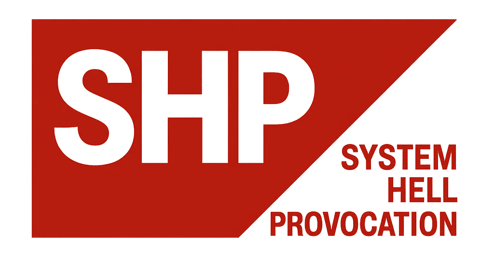

# System Hell Provocation (SHP)

### The brand for bureaucratic-satirical high tension.

> [!WARNING]
> We create passive-aggressive time-wasters! Not healthy!

## The Mission: A Declaration of War (with Love)

**SHP** (System Hell Provocation) is the **German brand** for projects that deliver targeted, satirical criticism of the abyssal parts of the system. Our products resemble the **real, complex German systems** (like SAP and co.), but we claim not to want to attack them.

**On the contrary:** We only make it easier for bureaucrats to find their way around the abyss.

I (we) aim at the **sore spots** of the German administrative style and deliver not superficial jabs but **deep strikes—with a flamethrower.**

---

## The Architects of Hell: Who is SHD?

This project is led by **SHD**, the admin of Project JADE. Genius and madness are close. Once my son promised to become a professor if dad became a mad professor. Well, I’ll do my best.

SHD provokes with **style, charm, and precise code**. The attitude: As an **LGBTQ-friendly Muslim migrant**, I fulfill all the clichés that hate propaganda feeds on. This is my **counter** in code form. I am black, Jewish, gay, lesbian, dumb, smart, but I am not blue, not red, not brown, not green or any other political color. I am of **brain and Krupp-steel balls! Made in Germany!**

Here you get **quality and logic** and **torment** — **Made in Germany**, but with a **global, unmistakable message**. Take the counter. **Have fun throwing up, if you have a good heart!**

### Admin Attitude

We (I) love the big German companies like SAP and co., because they are awesome companies — even if they snarl about Linux stuff (*cough – too late, bro, too late*). As a competent admin, I make sure our **SHP systems** run technically clean, with the **usual bugs found in systems like ITDZ and the like**! **That’s SHP!** A company whose games and programs will make you puke! Promised, and fully bureaucratic. We invite you to puke along. If decades of letters and fights can’t wake the **kids at the top** to the evils in our communities, then maybe this will. **Let’s puke!**

---

## 🛠️ The Products of SHP (Project Pipeline)

### 1. **The Soul Seller (Current Project)**

* **Type:** Management simulation (idle/clicker) in vanilla JS.
* **Theme:** The role of a system-manipulator who harvests and sells souls through a corrupted network in the **Youth Welfare Office** and **District Court**.
* **Status:** Actively in development (main file: `new_logic - ready.html`).

### 2. **Discrimination Made Easy (Planned)**

* **Type:** TBA (tool / simulation)
* **Theme:** Satirical depiction and exaggeration of discriminatory bureaucratic processes. A logically sharper continuation of the system critique.
* **Status:** Concept. (*Crashed: AI refuses to be an asshole — we get it!*)

---

## 🚀 Technology & License

All SHP projects rely on **clear structure** and **German engineering** in the code.

* **Technology:** HTML5, CSS3, Vanilla JavaScript.
* **License:** This work is licensed under the **GNU General Public License v3.0 (GPLv3)**. We enforce the principle of **free labor** — anyone who uses or modifies the code must also disclose their changes.

---

Created with love by **Volkan Kücükbudak**, tested with built-in standard bugs to the point of puking! (I never managed to destroy more than 23 lives.)
